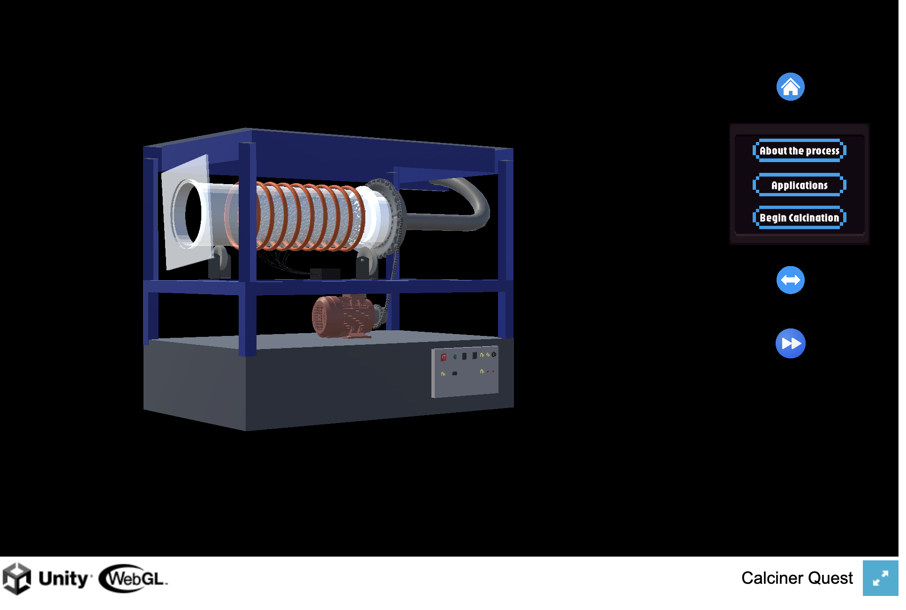

# Visualization of Process Engineering (Calciner) using Unity 3D — Calciner Quest

An interdisciplinary Unity 3D application that visualizes and simulates an **internal rotary calciner** to make process engineering concepts more intuitive for students and trainees.  
I led the 3D component modeling pipeline and Unity development, collaborating with Chemical Engineering students at OvGU to ensure the simulation reflects real-world equipment behavior and process context.

**WebGL app (play in browser):** [https://ranjith-24-prog.github.io/calciner_quest_unity_project/](https://ranjith-24-prog.github.io/calciner_quest_unity_project/)  
**Portfolio write-up:** [Calciner Quest (Unity 3D)](https://ranjith-mahesh-en.carrd.co/#unity)  
**University/Project:** Otto von Guericke University (OvGU) — Interdisciplinary team project

## Why this project
Industrial process equipment (like rotary calciners) is complex to understand from static diagrams alone, especially for beginners.

This project focuses on:
- Making calcination processes **visually intuitive** through interactive 3D exploration.
- Bridging theory to practice with component breakdowns, animations, and process explanations.
- Demonstrating effective collaboration between software/3D developers and chemical process experts.

## What the app includes
### 1) Intro & learning scenes
- Process overview and industrial context for calcination.
- Guided navigation to help new users understand the learning flow.

### 2) Component breakdown (digital twin view)
- Interactive 3D inspection of major calciner parts (e.g., rotary drum, motor/rollers, heating elements, control panel, exhaust path).
- Explanatory tooltips/dialogue to connect each component to its purpose and operation.

### 3) Simulation mode
- Animated drum rotation and material flow visualization.
- Temperature/heat behavior feedback (including color-based cues) to make process changes easy to interpret.
- A structured multi-scene workflow for exploration → understanding → simulation.

## Quick start (use the hosted WebGL app)
1. Open the WebGL demo: [https://ranjith-24-prog.github.io/calciner_quest_unity_project/](https://ranjith-24-prog.github.io/calciner_quest_unity_project/)
2. Start from the home screen (intro / credits / begin simulation).
3. Navigate through explanation + component scenes.
4. Use the 3D view to rotate/zoom and inspect the calciner.
5. Run the simulation and observe process-driven animations and visual feedback.
6. Replay scenes or return home to repeat exploration.

## Methodology (how it was built)
- **Agile delivery:** Planned and executed across ~10 sprints over 5 months with regular reviews and feedback cycles.
- **3D asset pipeline:** SolidWorks (high-fidelity component modeling) → Blender (refinement/texturing) → FBX export → Unity integration.
- **Unity implementation:** Multi-scene application with C# scripts for animations, interactions, and simulation behaviors.
- **Software engineering practices:** Applied maintainable patterns (e.g., Singleton, ECS concepts, Decorator) to keep the app modular and extensible.

## Output / learning value
- An interactive 3D learning tool that improves understanding of calciner structure, operation, and process flow.
- A reusable demonstration platform for education, lab teaching, and interdisciplinary presentations.

## Tech stack
- Unity 3D (real-time 3D engine; multi-scene interactive application)
- C# (Unity scripting for simulation behavior, UI flow, and interactivity)
- SolidWorks 2023 (CAD modeling of high-fidelity apparatus components)
- Blender (asset refinement, texturing, optimization for real-time rendering)
- WebGL build + GitHub Pages hosting for browser-based access

## Notes / limitations
- WebGL performance depends on browser/device resources; for best results use a modern desktop browser.
- Simulation is designed for educational visualization (not a replacement for high-fidelity process simulators).

## Future enhancements
- Add real-time parameter controls (temperature, feed rate) for experiment-style exploration.
- Add quizzes/challenges for deeper learning engagement.
- Expand to additional scenarios (different operating regimes) and optional VR support.
